## Introduction

- Form of `static analysis`
    - learn things about programs without executing them
    - can reason about `all` possible executions 
- `sound approximation` of `program semantics`
- formalised by `Radhia Cousot` and `Patrick Cousot` 

---

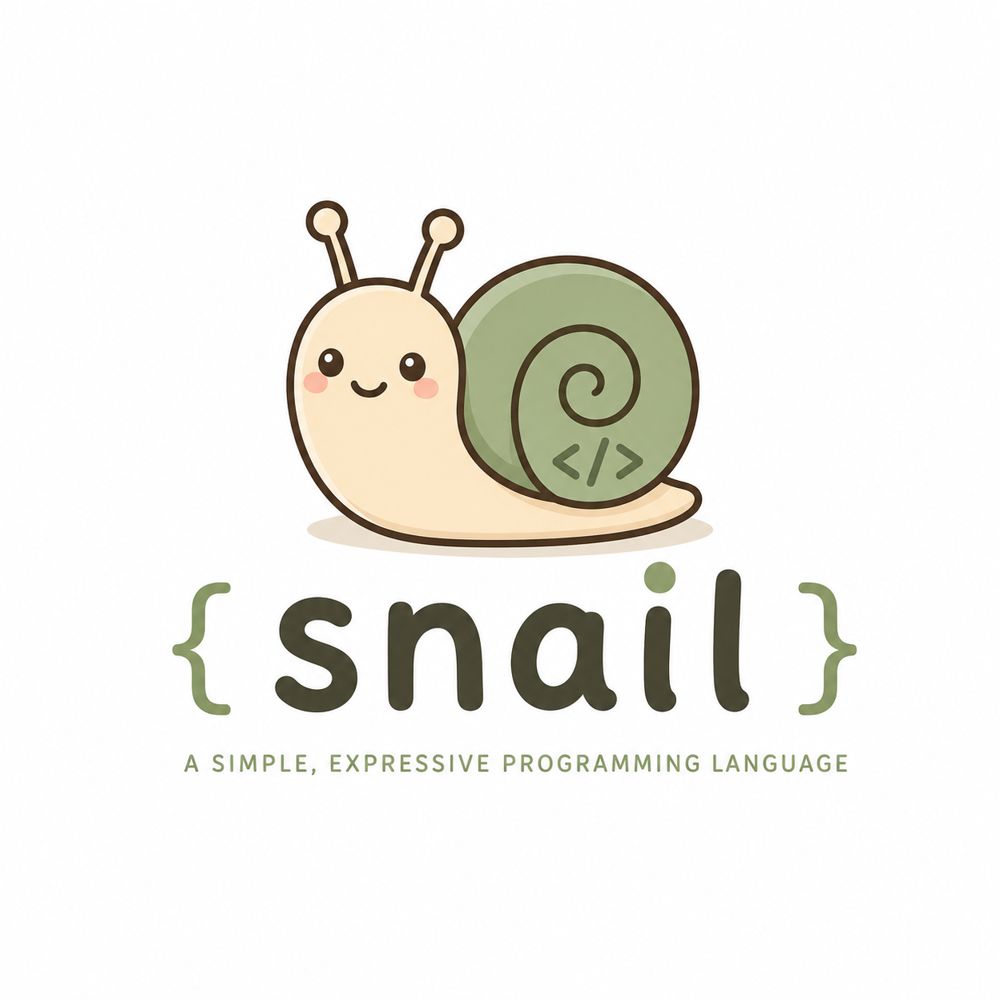{fig-align="center"}

## Snail Syntax

```{.default code-line-numbers="|1|2|3,5|4,6|"}
init([0.0,5.0],[-2.0,2.0])
repeat:
    either:
        move(1.0,0.0)
    or:
        move(0.0,1.0)
```

## Snail Semantics

Given a `snail` program $P$:

:::: {.columns}
::: {.column .fragment width="33%"}
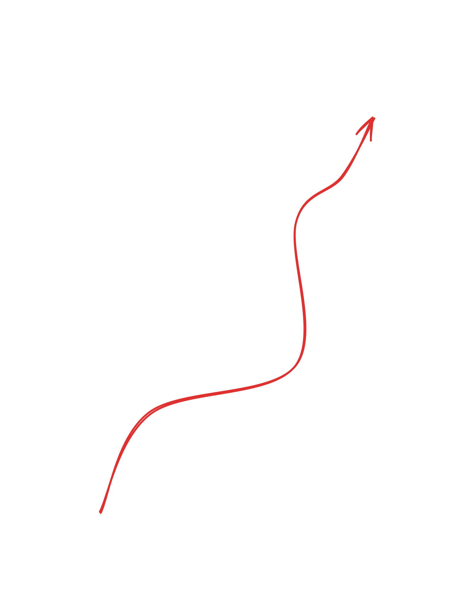{width="80%"}
$\texttt{eval}(P) \subseteq \mathbb{R}^2$
:::

::: {.column .fragment width="33%"}
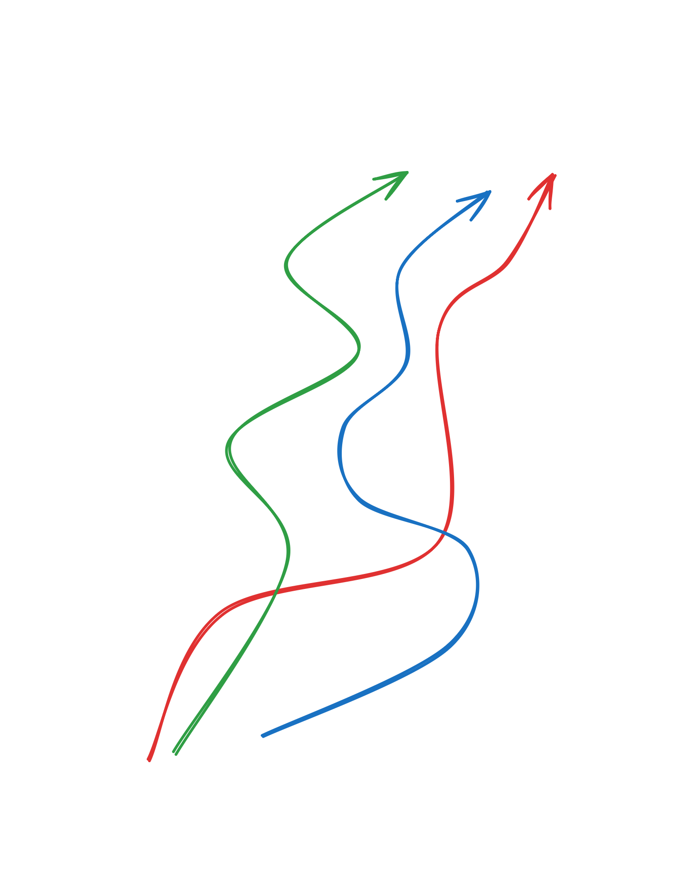{width="80%"}
$\texttt{eval}(P), \ldots$
:::

::: {.column .fragment width="33%"}
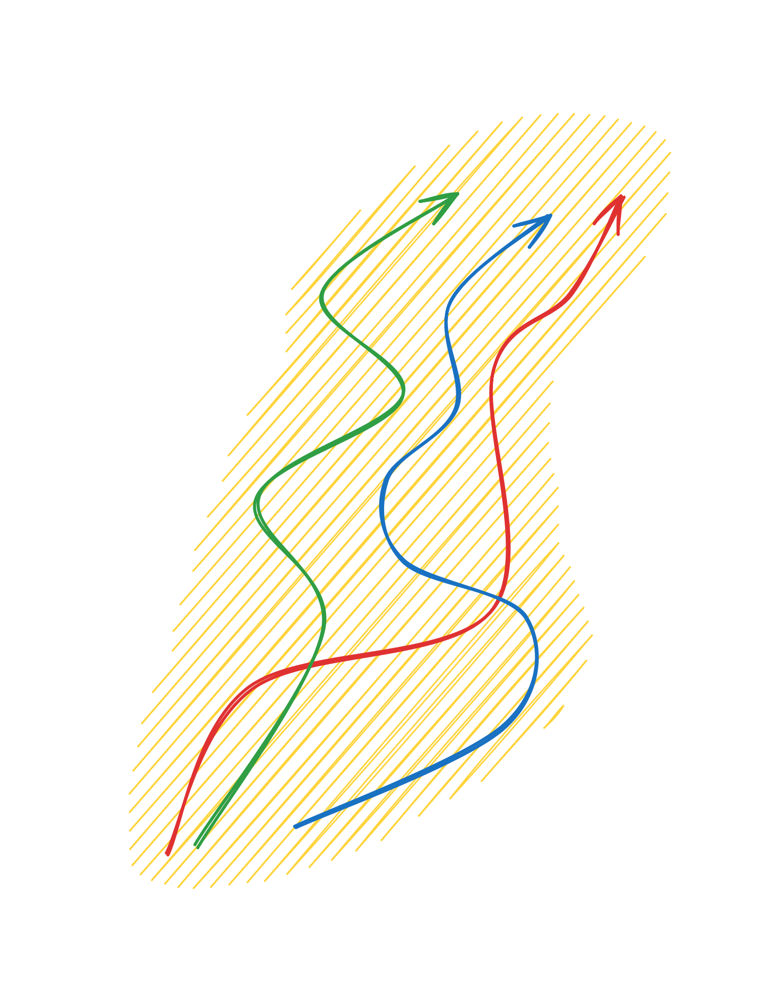{width="80%"}
$[\![P]\!] = \bigcup \texttt{eval}(P)$
:::
::::

## Safety in Snail

- When is a `snail` program $P$ safe?

$$\texttt{safe}(P) \Longleftrightarrow [\![P]\!] \cap \text{Gardens} = \varnothing$$

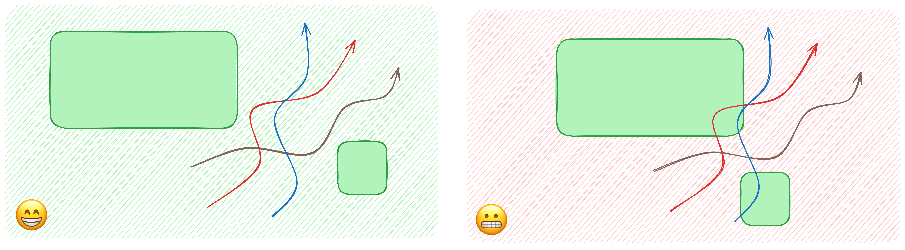

## Proving safety

- In general: $[\![P]\!]$ not computable
- We can over-approximate it though $\langle P \rangle$
- Sound: $\langle P \rangle \cap \text{Gardens} = \varnothing$ $\Rightarrow$ safety
- What is a good abstraction/over-approximation?
- How do we compute $\langle P \rangle$?

---

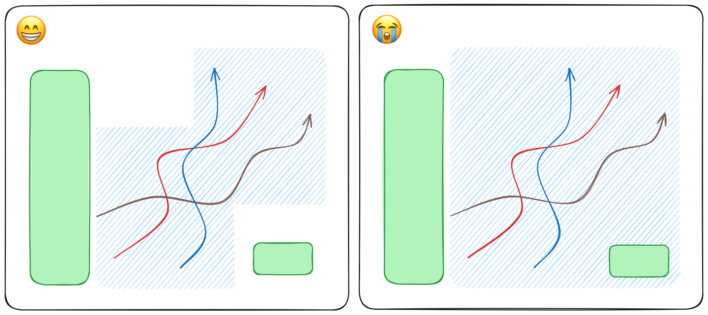

---

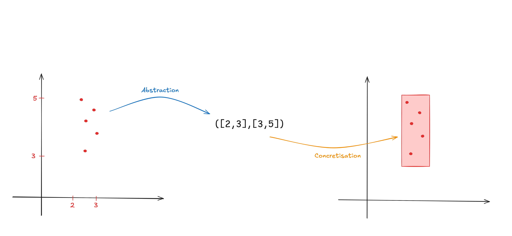

---

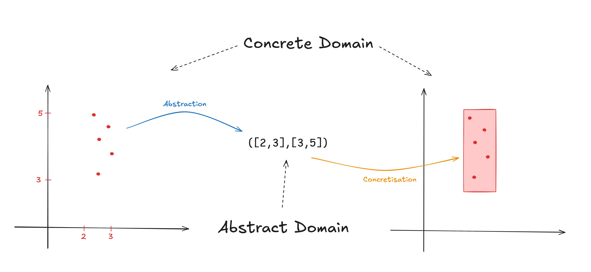

## Abstract Interpretation

- Define a suitable `Abstract Domain`
- Define `abstraction` and `contcretisation`
- Define `Abstract Semantics`

$$\texttt{analysis}(s, a) = a'$$

---

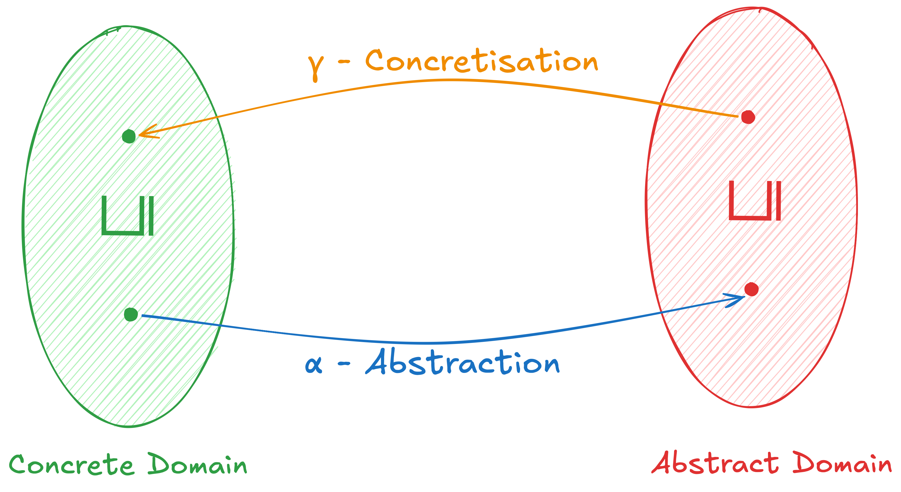

---

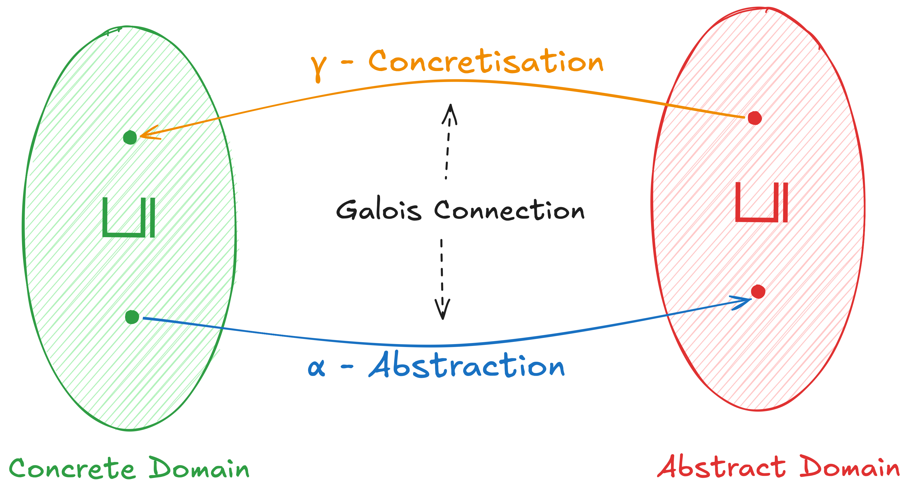

---

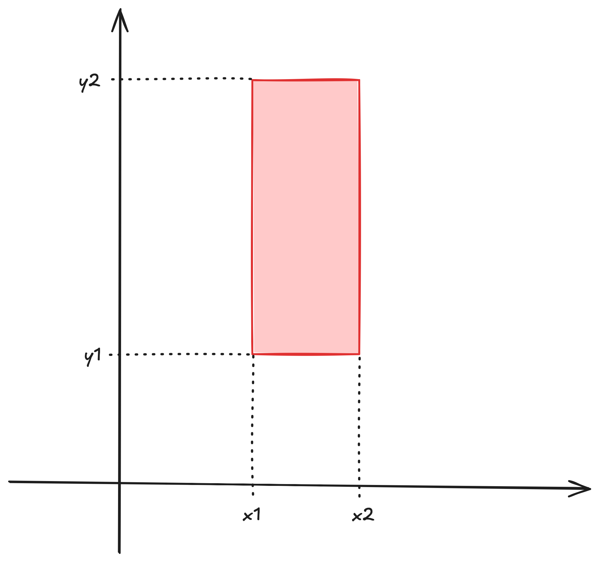{.nostretch fig-align="center" width="40%"}


$$\small\texttt{analysis}(\texttt{init}([x_1, x_2], [y_1, y_2], \text{_}) = ([x1, x2], [y1, y2])$$ 


---

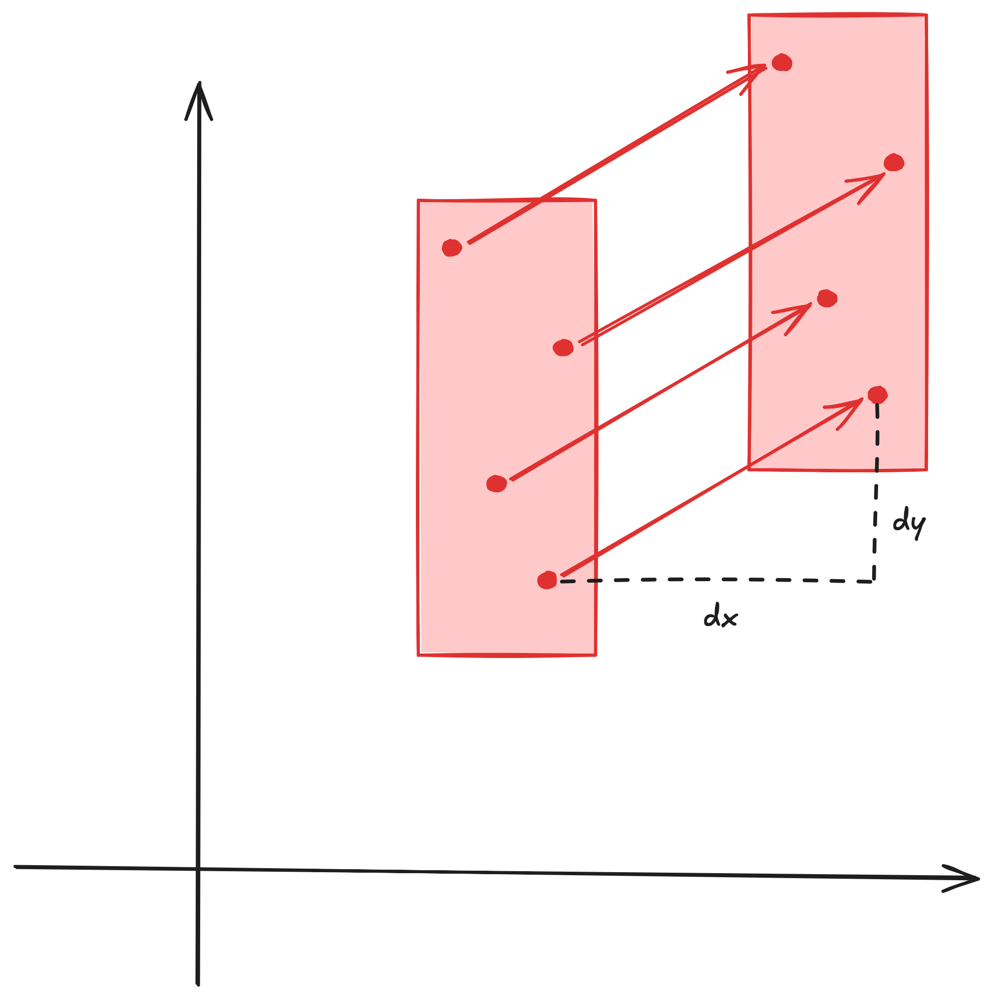{.nostretch fig-align="center" width="40%"}


$$\texttt{analysis}(\texttt{move}(d_x, d_y), ([x_1, x_2], [y_1, y_2])) \\= ([x_1+d_x, x_2+d_x],[y_1+d_y, y_2+d_y])$$


---

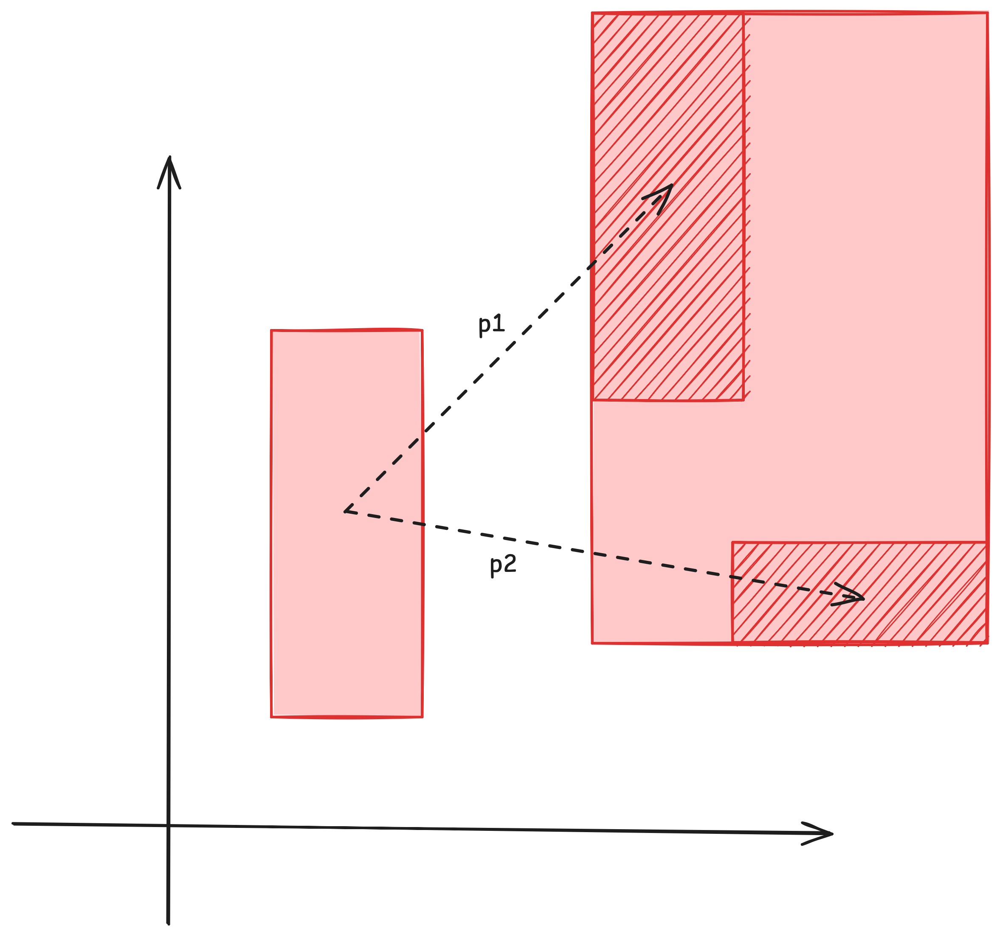{.nostretch fig-align="center" width="40%"}

::: {style="font-size: 65%;"}
$$
\texttt{analysis}(p_1, ([\overline{x}, \overline{y}])) = ([x'_1, x'_2], [y'_1, y'_2])\\
\texttt{analysis}(p_2, ([\overline{x}, \overline{y}])) = ([x''_1, x''_2], [y''_1, y''_2])\\
\texttt{analysis}(p_1\, \texttt{or}\; p_2, (\overline{x}, \overline{y})) \\
= ([\texttt{min}(x'_1, x''_1), \texttt{max}(x'_2, x''_2)], [\texttt{min}(y'_1, y''_1), \texttt{max}(y'_2, y''_2)])
$$
:::

--- 

## Iteration

```{.default}
repeat:
    b
```

Can be unrolled:

```{.default}
either: b
or:
    either: b
    or:
        either: b
        or:
            ...
```

Looking for fixpoint: $\texttt{analysis}(\texttt{repeat}\, b, a_k) = a_{k+1}$ 

## Example

:::{layout="[30, -10, 40]" layout-valign="center"}
```{.default}
init([0,5],[0,5])
repeat:
    either:
        move(1,0)
    or:
        move(0,1)
```

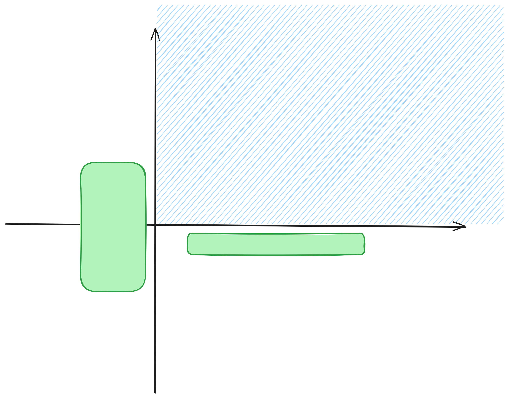
:::

## Other Abstract Domains

- Sign
- Octagons
- Convex Polyhedra
- ...

## Conclusion

- `AI` is a `sound overapproximation` of `program semantics`
- technique is automatic / push-button
- basis of many different analyses
    - e.g. in compilers

## Thank you!

[https://github.com/nikolaushuber/snail.git](https://github.com/nikolaushuber/snail.git)